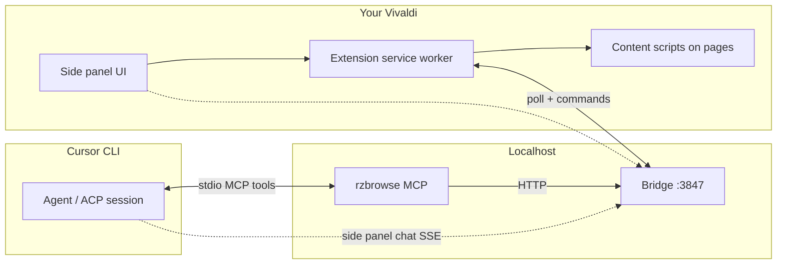

# Install & update RZBrowse

One script does everything: **install**, **update**, and **repair**. Safe to rerun.

```bash
./install.sh
```

Run `npm run setup` or `npm run update` (same script). For dependencies only: `npm ci --ignore-scripts`.

When `install.sh` finishes, it prints **FINISHED — you can close this terminal window.** The bridge runs as a background user service; you do not need to keep the terminal open.

## How it works

RZBrowse connects three pieces on your machine — **your Vivaldi browser**, a **local Node bridge**, and the **Cursor CLI** — so agents can see and control the tabs you already have open.



1. **`./install.sh`** copies the MV3 extension into Vivaldi, registers it, starts the **bridge** as a user `systemd` service (`http://127.0.0.1:3847`), and wires **`rzbrowse`** into Cursor’s MCP config.
2. **Extension (background)** keeps a long-lived link to the bridge. When automation is **On**, it accepts queued commands (navigate, snapshot, click, list tabs, …) and runs them against **your** Vivaldi profile.
3. **Page automation** tries a fast path first (content scripts build an interactive `@ref` tree). Hard pages (thin trees, cross-origin frames, canvas/WebGL) **escalate to CDP** inside the same tab — still your browser, not a second automation profile.
4. **Cursor agents** call `rzbrowse_*` tools via the MCP server → bridge → extension. The side panel can also chat through the bridge, which spawns **`agent acp`** sessions against your chosen project folder.
5. **Perplexity MCP** (optional) complements this: Perplexity answers from the web; RZBrowse operates on whatever is already loaded and signed in in Vivaldi.

Nothing leaves your machine except Cursor’s own API traffic for models/chat. Browser cookies and logins stay in Vivaldi.

See also [README.md](README.md) for screenshots, limitations, and daily-use notes.

## Requirements

- **Cursor account** — run `agent login` before using chat or MCP. Without a logged-in Cursor CLI session, the bridge cannot start agent sessions.
- Linux (Vivaldi or Chromium-based browser)
- Node.js 20+
- `curl`, `openssl`, `systemd` (user session)
- `git` (optional, for in-place updates via pull)

**Tested environment:** Pop!_OS Cosmic with **Vivaldi Flatpak** (`com.vivaldi.Vivaldi`). Other Linux + Vivaldi/Chromium setups may work but are not verified.

Optional: `chromium` or `google-chrome` on PATH — packs a `.crx` for silent extension install.

Optional but recommended: **Perplexity MCP** in Cursor — works especially well with RZBrowse (research via Perplexity, actions in your existing Vivaldi session).

## Your browser, your logins

RZBrowse automates **the Vivaldi profile you already use**, not a disposable agent browser. Sessions, cookies, and SSO from your daily browsing carry over — you do not need to sign in again on every site when an agent takes over.

## Vivaldi-specific notes

- **Tab tiling** (Vivaldi’s tiled tab stacks) is **fully supported** for browser automation and tab targeting.
- **Workspace tab list** in the side panel is **partially supported**. Vivaldi does not give extensions a reliable “current workspace” API, so the tab dropdown may show **all tabs in the current window** rather than only the active workspace. You can still target tabs by selecting them, using the active tab, or relying on tiling/group metadata when Vivaldi exposes it.

## First install

```bash
git clone https://github.com/platysonique/RZBrowse.git
cd RZBrowse
./install.sh
agent login
```

Restart Vivaldi. In the side panel, turn **Browser automation** **On** (default is off for security).

## Update (same script)

After `git pull` or copying new files into your clone:

```bash
cd RZBrowse
./install.sh
```

On **update**, the script by default:

1. Runs `git pull --ff-only` if the repo is clean (no local uncommitted changes)
2. Refreshes npm dependencies
3. Re-syncs the extension to `~/.local/share/daddyslittlehelper/extension`
4. Re-registers Vivaldi External Extensions / CRX
5. Updates MCP config and **restarts** the bridge (`systemd --user`)
6. Installs `~/.cursor/rules/rzbrowse-browser-automation.mdc` (agent how-to for RZBrowse)

Then restart Vivaldi once so the extension reloads.

### Options

| Flag | Effect |
|------|--------|
| `--pull` | Always `git pull --ff-only` (install or update) |
| `--no-pull` | Never pull; use files already on disk |
| `--no-git` | Skip all git operations |
| `--skip-doctor` | Skip health check at the end |
| `--help` | Show usage |

Examples:

```bash
./install.sh --pull          # update from remote, then apply
./install.sh --no-pull       # you already git pull'd; just sync services
```

## Verify

```bash
npm run doctor
```

## State file

`~/.config/daddyslittlehelper/install.env` records:

- `DLH_ROOT` — your clone path  
- `DLH_VERSION` — last applied package version  
- `INSTALLED_AT` / `UPDATED_AT`  

Second and later runs are detected as **update mode** automatically.

## Security toggle

Side panel → **Browser automation** → **On** when agents may control the browser. Off by default.

## Uninstall

```bash
systemctl --user disable --now daddyslittlehelper
rm -f ~/.config/systemd/user/daddyslittlehelper.service
rm -rf ~/.local/share/daddyslittlehelper
rm -rf ~/.config/daddyslittlehelper
rm -f ~/.local/bin/vivaldi-dlh
# Remove External Extensions/*.json under Vivaldi config (see extension.json)
systemctl --user daemon-reload
```

Remove `rzbrowse` from `~/.cursor/mcp.json` if desired.
