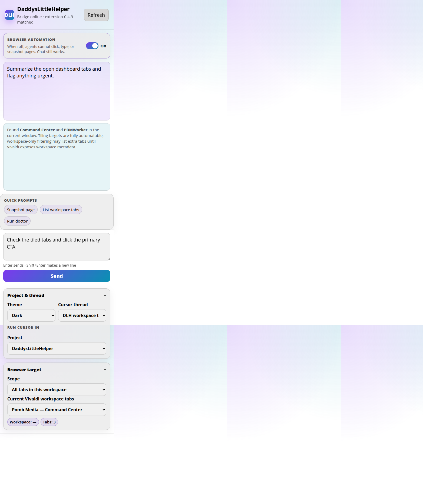
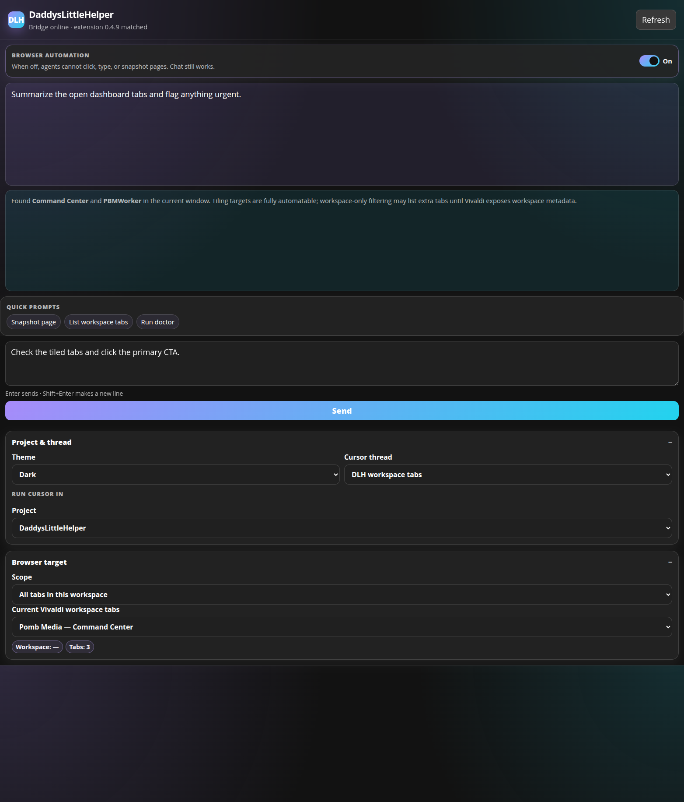
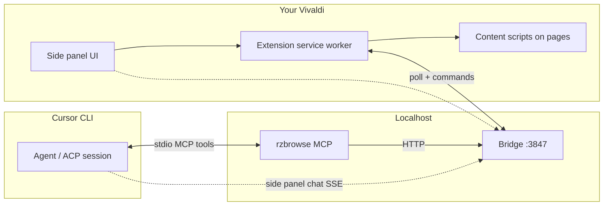

# RZBrowse

Vivaldi side panel + local bridge + **Cursor CLI** browser automation. No Playwright extension on your daily profile.

> **Brand:** RZBrowse. **MCP:** `rzbrowse` / `rzbrowse_*` (legacy `dlh-browser` / `dlh_browser_*` aliases). Paths/unit still `daddyslittlehelper`; same extension ID.

- **Side panel** chat tied to your selected project
- **`rzbrowse` MCP** for agents (`rzbrowse_snapshot`, `click`, `navigate`, …)
- **Automatic hard-page escalation** (content script → CDP when needed)
- **Your real browser** — agents drive the Vivaldi profile you already use (cookies, SSO, extensions). No spinning up a clean agentic browser and logging into everything again.

<p align="center">
  
  &nbsp;
  
</p>

## How it works

RZBrowse connects three pieces on your machine — **your Vivaldi browser**, a **local Node bridge**, and the **Cursor CLI** — so agents can see and control the tabs you already have open.



1. **`./install.sh`** copies the MV3 extension into Vivaldi, registers it, starts the **bridge** as a user `systemd` service (`http://127.0.0.1:3847`), and wires **`rzbrowse`** into Cursor’s MCP config.
2. **Extension (background)** keeps a long-lived link to the bridge. When automation is **On**, it accepts queued commands (navigate, snapshot, click, list tabs, …) and runs them against **your** Vivaldi profile.
3. **Page automation** tries a fast path first (content scripts build an interactive `@ref` tree). Hard pages (thin trees, cross-origin frames, canvas/WebGL) **escalate to CDP** inside the same tab — still your browser, not a second automation profile.
4. **Cursor agents** call `rzbrowse_*` tools via the MCP server → bridge → extension. The side panel can also chat through the bridge, which spawns **`agent acp`** sessions against your chosen project folder.
5. **Perplexity MCP** (optional) complements this: Perplexity answers from the web; RZBrowse operates on whatever is already loaded and signed in in Vivaldi.

Nothing leaves your machine except Cursor’s own API traffic for models/chat. Browser cookies and logins stay in Vivaldi.

## Why this exists

RZBrowse is especially useful alongside the **[Perplexity MCP](https://github.com/perplexityai/modelcontextprotocol)** in Cursor: Perplexity handles grounded search and research; `rzbrowse` acts on the pages already open in **your** Vivaldi window. You keep one logged-in environment instead of juggling a separate automation browser where every site wants a fresh sign-in.

**Typical combo:**
- `rzbrowse` — snapshot, click, navigate in Vivaldi
- Perplexity MCP — web search / grounded answers

Enable both in Cursor (`agent mcp enable rzbrowse` and your Perplexity server) after `agent login`.

## Requirements

- Cursor account (`agent login`)
- Linux + Vivaldi (Flatpak tested) or Chromium-based browser
- Node.js 20+
- `curl`, `openssl`, `systemd` (user session)

## Install

```bash
git clone https://github.com/platysonique/RZBrowse.git
cd RZBrowse
./install.sh
agent login
agent mcp enable rzbrowse   # if needed
```

Restart Vivaldi. In the side panel, turn **Browser automation** **On**.

**Update later:** `cd RZBrowse && ./install.sh` (pulls from git when already installed and the tree is clean). Use `npm run setup` / `npm run update` as aliases.

`./install.sh` also wires Cursor: writes `rzbrowse` into `~/.cursor/mcp.json`, enables the MCP when possible, and installs the always-on agent rule `~/.cursor/rules/rzbrowse-browser-automation.mdc` (same file lives in the repo under `.cursor/rules/`).

## Daily use

- Open the RZBrowse side panel in Vivaldi
- In Cursor CLI / agents, use `rzbrowse` tools against the active tab
- Use Perplexity MCP when you need external facts; use RZBrowse when you need to interact with tabs you already have open and authenticated

## Layout

| Path | Role |
|------|------|
| `extension/` | MV3 side panel + content scripts + CDP escalation |
| `bridge/` | Local HTTP/WS hub, ACP chat, tab leases |
| `mcp/rzbrowse.js` | MCP stdio server |
| `mcp/dlh-browser.js` | Compatibility wrapper → `rzbrowse.js` |

Extension source: `extension/` (installed copy under `~/.local/share/daddyslittlehelper/extension`).

See [INSTALL.md](INSTALL.md) for update, uninstall, and service details.
